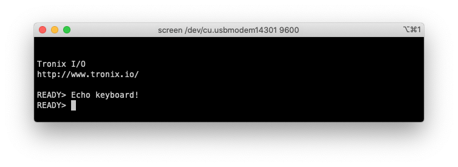

# PIC24FJxxGA002/4 - EUSART.

## 0.Contents.

- [1.PIC24FJxxGA002 - UART Rx/Tx Asynchronous - Internal Oscillator.](#1pic24fjxxga002---uart-rxtx-asynchronous---internal-oscillator)
- [2.PIC24FJxxGA004 - UART Rx/Tx Asynchronous - Internal Oscillator.](#2pic24fjxxga004---uart-rxtx-asynchronous---internal-oscillator)
- [3.PIC24FJxxGA004 - UART Rx/Tx Asynchronous - External MEMS.](#3pic24fjxxga004---uart-rxtx-asynchronous---external-mems)

## 1.PIC24FJxxGA002 - UART Rx/Tx Asynchronous - Internal Oscillator

```c
// Configuration Registers.
#pragma config POSCMOD = NONE, I2C1SEL = PRI, IOL1WAY = ON, OSCIOFNC = OFF
#pragma config FCKSM = CSDCMD, FNOSC = FRC, SOSCSEL = SOSC, WUTSEL = LEG
#pragma config IESO = OFF, WDTPS = PS32768, FWPSA = PR128, WINDIS = OFF
#pragma config FWDTEN = OFF, ICS = PGx1, GWRP = OFF, GCP = OFF, JTAGEN = OFF

#define FOSC    (8000000UL)
#define FCY     (FOSC/2)

#include <xc.h>
// PIC24FJxxGA002 - Compile with XC16(v2.00).
// PIC24FJxxGA002 - @8MHz Internal Oscillator.

// EUSART Asynchronous.

// MCU.RB0.EUSART.UTX.
// MCU.RB1.EUSART.RTX.

// PIC16-Bit Mini Trainer.
// JUMPER.URX - Close.
// JUMPER.UTX - Close.
// JUMPER.SDA - Open.
// JUMPER.SCL - Open.
// JUMPER.VREG - GND.
// JUMPER.VCAP - Close.
// JUMPER.BCKL - Open.

// PIC16-Bit Trainer.
// JUMPER.SDA - Open.
// JUMPER.SCL - Open.
// JUMPER.VEE - Open.
// JUMPER.BCKL - Open.
// JUMPER.VREG - GND.
// JUMPER.VCAP - Close.
// JUMPER.SPI/I2C - Open.

// Definitions.
// EUSART.
#define BAUDRATE                    9600
#define BAUDRATE_GENERATOR_BRGH_0   (((FCY/BAUDRATE)/16)-1)
#define BAUDRATE_GENERATOR_BRGH_1   (((FCY/BAUDRATE)/4)-1)
// ASCII Characters.
#define ASCII_CR                    0x0D

// Function Prototypes.
uint8_t eusart_readCharacter(void);
void eusart_writeCharacter(uint8_t u8Data);
void eusart_writeString(const uint8_t * u8Data);

// Strings.
const uint8_t au8Tronix[] = "\r\n\r\nTronix I/O";
const uint8_t au8WWW[] = "\r\nhttps://www.tronix.io/\r\n";
const uint8_t au8Ready[] = "\r\nREADY> ";

// Main.
int main(void)
{
    // MCU Initialization.
    // Oscillator Settings.
    CLKDIVbits.DOZE = 0b000;
    CLKDIVbits.DOZEN = 0b0;
    // Ports Initialization.
    // Analog Inputs Settings.
    AD1PCFG = 0b1001111000111111;
    // Port A Settings.
    TRISA = 0b0000000000000000;
    PORTA = 0b0000000000000000;
    LATA = 0b0000000000000000;
    ODCA = 0b0000000000000000;
    // Port B Settings.
    TRISB = 0b0000000000000010;
    PORTB = 0b0000000000000000;
    LATB = 0b0000000000000000;
    ODCB = 0b0000000000000000;
    // PPS Settings.
    __builtin_write_OSCCONL(OSCCON & 0xBF);
    // PPS Inputs.
    RPINR18bits.U1RXR = 0b00001;    // RB1 - RP1 - EUSART.U1RX.
    // PPS Outputs.
    RPOR0bits.RP0R = 0b00011;       // RB0 - RP0 - EUSART.U1TX.
    __builtin_write_OSCCONL(OSCCON | 0x40);

    // EUSART Settings.
    U1MODE = 0x0000;
    U1STA = 0x0000;
    U1TXREG = 0;
    U1RXREG = 0;
    U1BRG = BAUDRATE_GENERATOR_BRGH_0;
    // UART Enable.
    U1MODEbits.UARTEN = 0b1;
    U1STAbits.UTXEN = 0b1;

    // Display String.
    eusart_writeString(au8Tronix);
    eusart_writeString(au8WWW);
    eusart_writeString(au8Ready);

    uint8_t u8Rx;
    while(1){
        if(IFS0bits.U1RXIF){
            u8Rx = eusart_readCharacter();
            eusart_writeCharacter(u8Rx);
            if(u8Rx == ASCII_CR)
                eusart_writeString(au8Ready);
        }
    }
    return(0);
}

// Functions.
uint8_t eusart_readCharacter(void)
{
    if(U1STAbits.OERR){
        U1STAbits.OERR = 0b0;
    }

    while(!U1STAbits.URXDA){};
    return(U1RXREG);
}

void eusart_writeCharacter(uint8_t u8Data)
{
    while(U1STAbits.UTXBF){};
    U1TXREG = u8Data;
}

void eusart_writeString(const uint8_t * u8Data)
{
    while(*u8Data != '\0')
        eusart_writeCharacter(*u8Data++);
}
```

<p align="center"></p>

## 2.PIC24FJxxGA004 - UART Rx/Tx Asynchronous - Internal Oscillator.

```c
// Configuration Registers.
#pragma config POSCMOD = NONE, I2C1SEL = PRI, IOL1WAY = ON, OSCIOFNC = ON
#pragma config FCKSM = CSDCMD, FNOSC = FRC, SOSCSEL = SOSC, WUTSEL = LEG
#pragma config IESO = OFF, WDTPS = PS32768, FWPSA = PR128, WINDIS = OFF
#pragma config FWDTEN = OFF, ICS = PGx1, GWRP = OFF, GCP = OFF, JTAGEN = OFF

#define FOSC    (8000000UL)
#define FCY     (FOSC/2)

#include <xc.h>
// PIC24FJxxGA004 - Compile with XC16(v2.00).
// PIC24FJxxGA004 - @8MHz Internal Oscillator.

// UART Rx/Tx Asynchronous.

// MCU.RB6.UART.UTX.
// MCU.RB5.UART.RTX.

// PIC16-Bit Nano Trainer.
// JUMPER.SDA - Not Use.
// JUMPER.SCL - Not Use.

// Definitions.
// UART.
#define BAUDRATE            9600
#define BAUDRATE_GENERATOR  (((FCY/BAUDRATE)/16)-1)
// ASCII Characters.
#define ASCII_CR            0x0D

// Function Prototypes.
uint8_t uart_readCharacter(void);
void uart_writeCharacter(uint8_t u8Data);
void uart_writeString(const uint8_t * u8Data);

// Strings.
const uint8_t au8Tronix[] = "\r\n\r\nTronix I/O";
const uint8_t au8WWW[] = "\r\nhttps://www.tronix.io/\r\n";
const uint8_t au8Ready[] = "\r\nREADY> ";

// Main.
int main(void)
{
    // MCU Initialization.
    // Oscillator Settings.
    CLKDIVbits.DOZE = 0b000;
    CLKDIVbits.DOZEN = 0b0;
    // Ports Initialization.
    // Analog Inputs Settings.
    AD1PCFG = 0b1001111111111111;
    // Port A Settings.
    TRISA = 0b0000000000000000;
    PORTA = 0b0000000000000000;
    LATA = 0b0000000000000000;
    ODCA = 0b0000000000000000;
    // Port B Settings.
    TRISB = 0b0000000000100000;
    PORTB = 0b0000000000000000;
    LATB = 0b0000000000000000;
    ODCB = 0b0000000000000000;
    // Port C Settings.
    TRISC = 0b0000000000000000;
    PORTC = 0b0000000000000000;
    LATC = 0b0000000000000000;
    ODCC = 0b0000000000000000;
    // PPS Settings.
    __builtin_write_OSCCONL(OSCCON & 0xBF);
    // PPS Inputs.
    RPINR18bits.U1RXR = 0b00101;    // RB5 - RP5 - UART.U1RX.
    // PPS Outputs.
    RPOR3bits.RP6R = 0b00011;       // RB6 - RP6 - UART.U1TX.
    __builtin_write_OSCCONL(OSCCON | 0x40);

    // UART1 Settings.
    U1MODE = 0x0000;
    U1STA = 0x0000;
    U1TXREG = 0;
    U1RXREG = 0;
    U1BRG = BAUDRATE_GENERATOR;
    // UART1 Rx/Tx Enable.
    U1MODEbits.UARTEN = 0b1;
    U1STAbits.UTXEN = 0b1;

    // Display String.
    uart_writeString(au8Tronix);
    uart_writeString(au8WWW);
    uart_writeString(au8Ready);

    uint8_t u8Rx;
    while(1){
        if(IFS0bits.U1RXIF){
            u8Rx = uart_readCharacter();
            uart_writeCharacter(u8Rx);
            if(u8Rx == ASCII_CR)
                uart_writeString(au8Ready);
        }
    }
    return(0);
}

// Functions.
uint8_t uart_readCharacter(void)
{
    if(U1STAbits.OERR){
        U1STAbits.OERR = 0b0;
    }

    while(!U1STAbits.URXDA){};
    return(U1RXREG);
}

void uart_writeCharacter(uint8_t u8Data)
{
    while(U1STAbits.UTXBF){};
    U1TXREG = u8Data;
}

void uart_writeString(const uint8_t * u8Data)
{
    while(*u8Data != '\0')
        uart_writeCharacter(*u8Data++);
}
```

<p align="center"></p>

## 3.PIC24FJxxGA004 - UART Rx/Tx Asynchronous - External MEMS.

```c
// Configuration Registers.
#pragma config POSCMOD = EC, I2C1SEL = PRI, IOL1WAY = ON, OSCIOFNC = ON
#pragma config FCKSM = CSDCMD, FNOSC = PRI, SOSCSEL = SOSC, WUTSEL = LEG
#pragma config IESO = OFF, WDTPS = PS32768, FWPSA = PR128, WINDIS = OFF
#pragma config FWDTEN = OFF, ICS = PGx1, GWRP = OFF, GCP = OFF, JTAGEN = OFF

#define FOSC    (24576000UL)
#define FCY     (FOSC/2)

#include <xc.h>
// PIC24FJxxGA004 - Compile with XC16(v2.00).
// PIC24FJxxGA004 - @24.576MHz External Oscillator.

// UART Rx/Tx Asynchronous.

// MCU.RB6.UART.UTX.
// MCU.RB5.UART.RTX.

// PIC16-Bit Nano Trainer.
// JUMPER.SDA - Not Use.
// JUMPER.SCL - Not Use.

// Definitions.
// UART.
#define BAUDRATE            19200
#define BAUDRATE_GENERATOR  (((FCY/BAUDRATE)/4)-1)
// ASCII Characters.
#define ASCII_CR            0x0D

// Function Prototypes.
uint8_t uart_readCharacter(void);
void uart_writeCharacter(uint8_t u8Data);
void uart_writeString(const uint8_t * u8Data);

// Strings.
const uint8_t au8Tronix[] = "\r\n\r\nTronix I/O";
const uint8_t au8WWW[] = "\r\nhttps://www.tronix.io/\r\n";
const uint8_t au8Ready[] = "\r\nREADY> ";

// Main.
int main(void)
{
    // MCU Initialization.
    // Oscillator Settings.
    CLKDIVbits.DOZE = 0b000;
    CLKDIVbits.DOZEN = 0b0;
    // Ports Initialization.
    // Analog Inputs Settings.
    AD1PCFG = 0b1001111111111111;
    // Port A Settings.
    TRISA = 0b0000000000000000;
    PORTA = 0b0000000000000000;
    LATA = 0b0000000000000000;
    ODCA = 0b0000000000000000;
    // Port B Settings.
    TRISB = 0b0000000000100000;
    PORTB = 0b0000000000000000;
    LATB = 0b0000000000000000;
    ODCB = 0b0000000000000000;
    // Port C Settings.
    TRISC = 0b0000000000000000;
    PORTC = 0b0000000000000000;
    LATC = 0b0000000000000000;
    ODCC = 0b0000000000000000;
    // PPS Settings.
    __builtin_write_OSCCONL(OSCCON & 0xBF);
    // PPS Inputs.
    RPINR18bits.U1RXR = 0b00101;    // RB5 - RP5 - UART.U1RX.
    // PPS Outputs.
    RPOR3bits.RP6R = 0b00011;       // RB6 - RP6 - UART.U1TX.
    __builtin_write_OSCCONL(OSCCON | 0x40);

    // UART1 Settings.
    U1MODE = 0x0008;
    U1STA = 0x0000;
    U1TXREG = 0;
    U1RXREG = 0;
    U1BRG = BAUDRATE_GENERATOR;
    // UART1 Rx/Tx Enable.
    U1MODEbits.UARTEN = 0b1;
    U1STAbits.UTXEN = 0b1;

    // Display String.
    uart_writeString(au8Tronix);
    uart_writeString(au8WWW);
    uart_writeString(au8Ready);

    uint8_t u8Rx;
    while(1){
        if(IFS0bits.U1RXIF){
            u8Rx = uart_readCharacter();
            uart_writeCharacter(u8Rx);
            if(u8Rx == ASCII_CR)
                uart_writeString(au8Ready);
        }
    }
    return(0);
}

// Functions.
uint8_t uart_readCharacter(void)
{
    if(U1STAbits.OERR){
        U1STAbits.OERR = 0b0;
    }

    while(!U1STAbits.URXDA){};
    return(U1RXREG);
}

void uart_writeCharacter(uint8_t u8Data)
{
    while(U1STAbits.UTXBF){};
    U1TXREG = u8Data;
}

void uart_writeString(const uint8_t * u8Data)
{
    while(*u8Data != '\0')
        uart_writeCharacter(*u8Data++);
}
```

<p align="center"></p>

---
DISCLAIMER: THIS CODE IS PROVIDED WITHOUT ANY WARRANTY OR GUARANTEES.
USERS MAY USE THIS CODE FOR DEVELOPMENT AND EXAMPLE PURPOSES ONLY.
AUTHORS ARE NOT RESPONSIBLE FOR ANY ERRORS, OMISSIONS, OR DAMAGES THAT COULD
RESULT FROM USING THIS FIRMWARE IN WHOLE OR IN PART.
