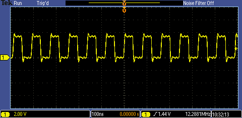

# PIC24FJxxGA002/4 - External Oscillator.

## 0.Contents.

- [1.EC - External Clock.](./extosc.md#1ec---external-clock)

## 1.EC - External Clock.

```c
// Configuration Registers.
#pragma config POSCMOD = EC, I2C1SEL = PRI, IOL1WAY = ON, OSCIOFNC = OFF
#pragma config FCKSM = CSDCMD, FNOSC = PRI, SOSCSEL = SOSC, WUTSEL = LEG
#pragma config IESO = OFF, WDTPS = PS32768, FWPSA = PR128, WINDIS = OFF
#pragma config FWDTEN = OFF, ICS = PGx1, GWRP = OFF, GCP = OFF, JTAGEN = OFF

#include <xc.h>
// PIC24FJxxGA002/4 - Compile with XC16(v2.00).
// PIC24FJxxGA002/4 - @24.576MHz External Oscillator.

// EC External Oscillator.
// Clock Out Enable on RA3.

// MCU.RA3 -> OSCILLOSCOPE.PROBE.A.

// PIC16-Bit Nano Trainer with MEMS DSC1001CI2-024.5760.
// JUMPER.SDA - Open.
// JUMPER.SCL - Open.

// Main.
int main(void)
{
    // MCU Initialization.
    // Oscillator Settings.
    // DOZE - Clock Ratio.
    // DOZE2.0 = 1 1 1 - 1:128.
    // DOZE2.0 = 1 1 0 - 1:64.
    // DOZE2.0 = 1 0 1 - 1:32.
    // DOZE2.0 = 1 0 0 - 1:16.
    // DOZE2.0 = 0 1 1 - 1:8.
    // DOZE2.0 = 0 1 0 - 1:4.
    // DOZE2.0 = 0 0 1 - 1:2.
    // DOZE2.0 = 0 0 0 - 1:1.
    CLKDIVbits.DOZE = 0b000;
    // DOZE - Clock Ratio Enable.
    // DOZEN.0 = 1 - DOZE Enable.
    // DOZEN.0 = 0 - DOZE Disable.
    CLKDIVbits.DOZEN = 0b0;

    while(1){
    }
    return(0);
}
```

- FOSC=24.576MHz, DOZE=000, DOZEN=0.

<p align="center"></p>

---
DISCLAIMER: THIS CODE IS PROVIDED WITHOUT ANY WARRANTY OR GUARANTEES.
USERS MAY USE THIS CODE FOR DEVELOPMENT AND EXAMPLE PURPOSES ONLY.
AUTHORS ARE NOT RESPONSIBLE FOR ANY ERRORS, OMISSIONS, OR DAMAGES THAT COULD
RESULT FROM USING THIS FIRMWARE IN WHOLE OR IN PART.
