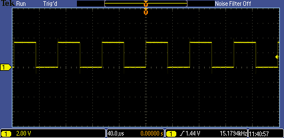
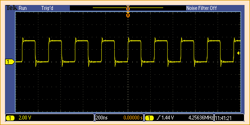
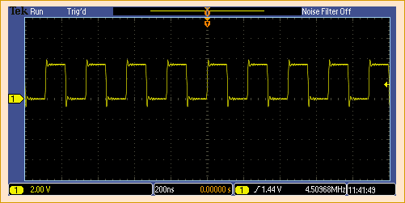
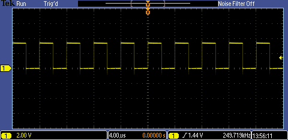
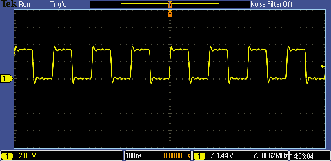

# PIC24FJxxGA002/4 - Internal Oscillator.

## 0.Contents.

- [1.LPRC - Low-Power Internal Oscillator.](./intosc.md#1lprc---low-power-internal-oscillator)
- [2.FRC - Fast Internal Oscillator.](./intosc.md#2frc---fast-internal-oscillator)
- [3.FRCDIV - Fast Internal Oscillator with Postscaler.](./intosc.md#3frcdiv---fast-internal-oscillator-with-postscaler)
- [4.FRCPLL - Fast Internal Oscillator with PLL.](./intosc.md#4frcpll---fast-internal-oscillator-with-pll)

## 1.LPRC - Low-Power Internal Oscillator.

```c
// Configuration Registers.
#pragma config POSCMOD = NONE, I2C1SEL = PRI, IOL1WAY = ON, OSCIOFNC = OFF
#pragma config FCKSM = CSDCMD, FNOSC = LPRC, SOSCSEL = SOSC, WUTSEL = LEG
#pragma config IESO = OFF, WDTPS = PS32768, FWPSA = PR128, WINDIS = OFF
#pragma config FWDTEN = OFF, ICS = PGx1, GWRP = OFF, GCP = OFF, JTAGEN = OFF

#include <xc.h>
// PIC24FJxxGA002/4 - Compile with XC16(v2.00).
// PIC24FJxxGA002/4 - @xMHz Internal Oscillator.

// Low-Power Internal Internal Oscillator.
// Clock Out Enable on RA3.

// MCU.RA3 -> OSCILLOSCOPE.PROBE.A.

// PIC16-Bit Nano Trainer.
// JUMPER.SDA - Open.
// JUMPER.SCL - Open.

// PIC16-Bit Mini Trainer.
// JUMPER.URX - Open.
// JUMPER.UTX - Open.
// JUMPER.SDA - Open.
// JUMPER.SCL - Open.
// JUMPER.VREG - GND.
// JUMPER.VCAP - Close.
// JUMPER.BCKL - Open.

// PIC16-Bit Trainer.
// JUMPER.SDA - Open.
// JUMPER.SCL - Open.
// JUMPER.VEE - Open.
// JUMPER.BCKL - Open.
// JUMPER.VREG - GND.
// JUMPER.VCAP - Close.
// JUMPER.SPI/I2C - Open.

// Main.
int main(void)
{
    // MCU Initialization.
    // Oscillator Settings.
    // DOZE - Clock Ratio.
    // DOZE2.0 = 1 1 1 - 1:128.
    // DOZE2.0 = 1 1 0 - 1:64.
    // DOZE2.0 = 1 0 1 - 1:32.
    // DOZE2.0 = 1 0 0 - 1:16.
    // DOZE2.0 = 0 1 1 - 1:8.
    // DOZE2.0 = 0 1 0 - 1:4.
    // DOZE2.0 = 0 0 1 - 1:2.
    // DOZE2.0 = 0 0 0 - 1:1.
    CLKDIVbits.DOZE = 0b000;
    // DOZE - Clock Ratio Enable.
    // DOZEN.0 = 1 - DOZE Enable.
    // DOZEN.0 = 0 - DOZE Disable.
    CLKDIVbits.DOZEN = 0b0;

    while(1){
    }
    return(0);
}
```

- FOSC=31kHz, DOZE=000, DOZEN=0.

<p align="center"></p>

## 2.FRC - Fast Internal Oscillator.

```c
// Configuration Registers.
#pragma config POSCMOD = NONE, I2C1SEL = PRI, IOL1WAY = ON, OSCIOFNC = OFF
#pragma config FCKSM = CSDCMD, FNOSC = FRC, SOSCSEL = SOSC, WUTSEL = LEG
#pragma config IESO = OFF, WDTPS = PS32768, FWPSA = PR128, WINDIS = OFF
#pragma config FWDTEN = OFF, ICS = PGx1, GWRP = OFF, GCP = OFF, JTAGEN = OFF

#include <xc.h>
// PIC24FJxxGA002/4 - Compile with XC16(v2.00).
// PIC24FJxxGA002/4 - @xMHz Internal Oscillator.

// Fast Internal Internal Oscillator.
// Clock Out Enable on RA3.

// MCU.RA3 -> OSCILLOSCOPE.PROBE.A.

// PIC16-Bit Nano Trainer.
// JUMPER.SDA - Open.
// JUMPER.SCL - Open.

// PIC16-Bit Mini Trainer.
// JUMPER.URX - Open.
// JUMPER.UTX - Open.
// JUMPER.SDA - Open.
// JUMPER.SCL - Open.
// JUMPER.VREG - GND.
// JUMPER.VCAP - Close.
// JUMPER.BCKL - Open.

// PIC16-Bit Trainer.
// JUMPER.SDA - Open.
// JUMPER.SCL - Open.
// JUMPER.VEE - Open.
// JUMPER.BCKL - Open.
// JUMPER.VREG - GND.
// JUMPER.VCAP - Close.
// JUMPER.SPI/I2C - Open.

// Main.
int main(void)
{
    // MCU Initialization.
    // Oscillator Settings.
    // DOZE - Clock Ratio.
    // DOZE2.0 = 1 1 1 - 1:128.
    // DOZE2.0 = 1 1 0 - 1:64.
    // DOZE2.0 = 1 0 1 - 1:32.
    // DOZE2.0 = 1 0 0 - 1:16.
    // DOZE2.0 = 0 1 1 - 1:8.
    // DOZE2.0 = 0 1 0 - 1:4.
    // DOZE2.0 = 0 0 1 - 1:2.
    // DOZE2.0 = 0 0 0 - 1:1.
    CLKDIVbits.DOZE = 0b000;
    // DOZE - Clock Ratio Enable.
    // DOZEN.0 = 1 - DOZE Enable.
    // DOZEN.0 = 0 - DOZE Disable.
    CLKDIVbits.DOZEN = 0b0;
    // OSCTUNE - Oscillator Tuning.
    // OSCTUNE5.0 = 0 1 1 1 1 1 - Maximum Frequency.
    // ...
    // OSCTUNE5.0 = 0 0 0 0 0 0 - Factory Calibrated Frequency.
    // ...
    // OSCTUNE5.0 = 1 0 0 0 0 0 - Minimum Frequency.
    OSCTUNbits.TUN = 0b000000;

    while(1){
    }
    return(0);
}
```

- FOSC=8MHz, DOZE=000, DOZEN=0, OSCTUN=100000.

<p align="center"></p>

- FOSC=8MHz, DOZE=000, DOZEN=0, OSCTUN=000000.

<p align="center"></p>

- FOSC=8MHz, DOZE=000, DOZEN=0, OSCTUN=011111.

<p align="center"></p>

## 3.FRCDIV - Fast Internal Oscillator with Postscaler.

```c
// Configuration Registers.
#pragma config POSCMOD = NONE, I2C1SEL = PRI, IOL1WAY = ON, OSCIOFNC = OFF
#pragma config FCKSM = CSDCMD, FNOSC = FRCDIV, SOSCSEL = SOSC, WUTSEL = LEG
#pragma config IESO = OFF, WDTPS = PS32768, FWPSA = PR128, WINDIS = OFF
#pragma config FWDTEN = OFF, ICS = PGx1, GWRP = OFF, GCP = OFF, JTAGEN = OFF

#include <xc.h>
// PIC24FJxxGA002/4 - Compile with XC16(v2.00).
// PIC24FJxxGA002/4 - @xMHz Internal Oscillator.

// Fast Internal Oscillator with Postscaler.
// Clock Out Enable on RA3.

// MCU.RA3 -> OSCILLOSCOPE.PROBE.A.

// PIC16-Bit Nano Trainer.
// JUMPER.SDA - Open.
// JUMPER.SCL - Open.

// PIC16-Bit Mini Trainer.
// JUMPER.URX - Open.
// JUMPER.UTX - Open.
// JUMPER.SDA - Open.
// JUMPER.SCL - Open.
// JUMPER.VREG - GND.
// JUMPER.VCAP - Close.
// JUMPER.BCKL - Open.

// PIC16-Bit Trainer.
// JUMPER.SDA - Open.
// JUMPER.SCL - Open.
// JUMPER.VEE - Open.
// JUMPER.BCKL - Open.
// JUMPER.VREG - GND.
// JUMPER.VCAP - Close.
// JUMPER.SPI/I2C - Open.

// Main.
int main(void)
{
    // MCU Initialization.
    // Oscillator Settings.
    // DOZE - Clock Ratio.
    // DOZE2.0 = 1 1 1 - 1:128.
    // DOZE2.0 = 1 1 0 - 1:64.
    // DOZE2.0 = 1 0 1 - 1:32.
    // DOZE2.0 = 1 0 0 - 1:16.
    // DOZE2.0 = 0 1 1 - 1:8.
    // DOZE2.0 = 0 1 0 - 1:4.
    // DOZE2.0 = 0 0 1 - 1:2.
    // DOZE2.0 = 0 0 0 - 1:1.
    CLKDIVbits.DOZE = 0b000;
    // DOZE - Clock Ratio Enable.
    // DOZEN.0 = 1 - DOZE Enable.
    // DOZEN.0 = 0 - DOZE Disable.
    CLKDIVbits.DOZEN = 0b0;
    // FRCDIV Postscaler.
    // 111 = 31.25kHz.
    // 110 = 125kHz.
    // 101 = 250kHz.
    // 100 = 500kHz.
    // 011 = 1MHz.
    // 010 = 2MHz.
    // 001 = 4MHz.
    // 000 = 8MHz.
    CLKDIVbits.RCDIV = 0b000;
    // OSCTUNE - Oscillator Tuning.
    // OSCTUNE5.0 = 0 1 1 1 1 1 - Maximum Frequency.
    // ...
    // OSCTUNE5.0 = 0 0 0 0 0 0 - Factory Calibrated Frequency.
    // ...
    // OSCTUNE5.0 = 1 0 0 0 0 0 - Minimum Frequency.
    OSCTUNbits.TUN = 0b000000;

    while(1){
    }
    return(0);
}
```

- FOSC=8MHz, RCDIV=000, DOZE=000, DOZEN=0, OSCTUN=000000.

<p align="center"></p>

- FOSC=4MHz, RCDIV=001, DOZE=000, DOZEN=0, OSCTUN=000000.

<p align="center"></p>

- FOSC=2MHz, RCDIV=010, DOZE=000, DOZEN=0, OSCTUN=000000.

<p align="center"></p>

- FOSC=1MHz, RCDIV=011, DOZE=000, DOZEN=0, OSCTUN=000000.

<p align="center"></p>

- FOSC=500kHz, RCDIV=100, DOZE=000, DOZEN=0, OSCTUN=000000.

<p align="center"></p>

- FOSC=250kHz, RCDIV=101, DOZE=000, DOZEN=0, OSCTUN=000000.

<p align="center"></p>

- FOSC=125kHz, RCDIV=110, DOZE=000, DOZEN=0, OSCTUN=000000.

<p align="center"></p>

- FOSC=31.25kHz, RCDIV=111, DOZE=000, DOZEN=0, OSCTUN=000000.

<p align="center"></p>

## 4.FRCPLL - Fast Internal Oscillator with PLL.

```c
// Configuration Registers.
#pragma config POSCMOD = NONE, I2C1SEL = PRI, IOL1WAY = ON, OSCIOFNC = OFF
#pragma config FCKSM = CSDCMD, FNOSC = FRCPLL, SOSCSEL = SOSC, WUTSEL = LEG
#pragma config IESO = OFF, WDTPS = PS32768, FWPSA = PR128, WINDIS = OFF
#pragma config FWDTEN = OFF, ICS = PGx1, GWRP = OFF, GCP = OFF, JTAGEN = OFF

#include <xc.h>
// PIC24FJxxGA002/4 - Compile with XC16(v2.00).
// PIC24FJxxGA002/4 - @xMHz Internal Oscillator.

// Fast Internal Oscillator with PLL.
// Clock Out Enable on RA3.

// MCU.RA3 -> OSCILLOSCOPE.PROBE.A.

// PIC16-Bit Nano Trainer.
// JUMPER.SDA - Open.
// JUMPER.SCL - Open.

// PIC16-Bit Mini Trainer.
// JUMPER.URX - Open.
// JUMPER.UTX - Open.
// JUMPER.SDA - Open.
// JUMPER.SCL - Open.
// JUMPER.VREG - GND.
// JUMPER.VCAP - Close.
// JUMPER.BCKL - Open.

// PIC16-Bit Trainer.
// JUMPER.SDA - Open.
// JUMPER.SCL - Open.
// JUMPER.VEE - Open.
// JUMPER.BCKL - Open.
// JUMPER.VREG - GND.
// JUMPER.VCAP - Close.
// JUMPER.SPI/I2C - Open.

// Main.
int main(void)
{
    // MCU Initialization.
    // Oscillator Settings.
    // DOZE - Clock Ratio.
    // DOZE2.0 = 1 1 1 - 1:128.
    // DOZE2.0 = 1 1 0 - 1:64.
    // DOZE2.0 = 1 0 1 - 1:32.
    // DOZE2.0 = 1 0 0 - 1:16.
    // DOZE2.0 = 0 1 1 - 1:8.
    // DOZE2.0 = 0 1 0 - 1:4.
    // DOZE2.0 = 0 0 1 - 1:2.
    // DOZE2.0 = 0 0 0 - 1:1.
    CLKDIVbits.DOZE = 0b000;
    // DOZE - Clock Ratio Enable.
    // DOZEN.0 = 1 - DOZE Enable.
    // DOZEN.0 = 0 - DOZE Disable.
    CLKDIVbits.DOZEN = 0b0;
    // FRCDIV Postscaler.
    // 001 = 4MHz.
    // 000 = 8MHz.
    CLKDIVbits.RCDIV = 0b000;
    // OSCTUNE - Oscillator Tuning.
    // OSCTUNE5.0 = 0 1 1 1 1 1 - Maximum Frequency.
    // ...
    // OSCTUNE5.0 = 0 0 0 0 0 0 - Factory Calibrated Frequency.
    // ...
    // OSCTUNE5.0 = 1 0 0 0 0 0 - Minimum Frequency.
    OSCTUNbits.TUN = 0b000000;

    while(1){
    }
    return(0);
}
```

- FOSC=32MHz, RCDIV=000, DOZE=000, DOZEN=0, OSCTUN=000000.

<p align="center"></p>

- FOSC=16MHz, RCDIV=001, DOZE=000, DOZEN=0, OSCTUN=000000.

<p align="center"></p>

---
DISCLAIMER: THIS CODE IS PROVIDED WITHOUT ANY WARRANTY OR GUARANTEES.
USERS MAY USE THIS CODE FOR DEVELOPMENT AND EXAMPLE PURPOSES ONLY.
AUTHORS ARE NOT RESPONSIBLE FOR ANY ERRORS, OMISSIONS, OR DAMAGES THAT COULD
RESULT FROM USING THIS FIRMWARE IN WHOLE OR IN PART.
