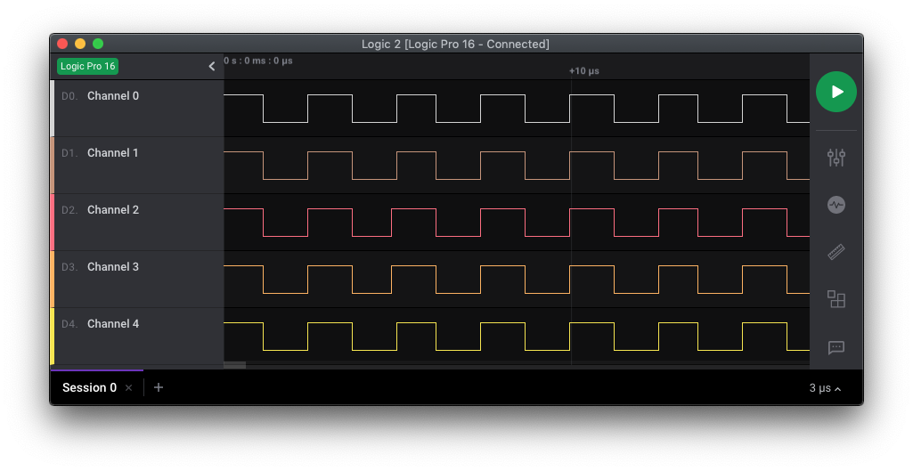
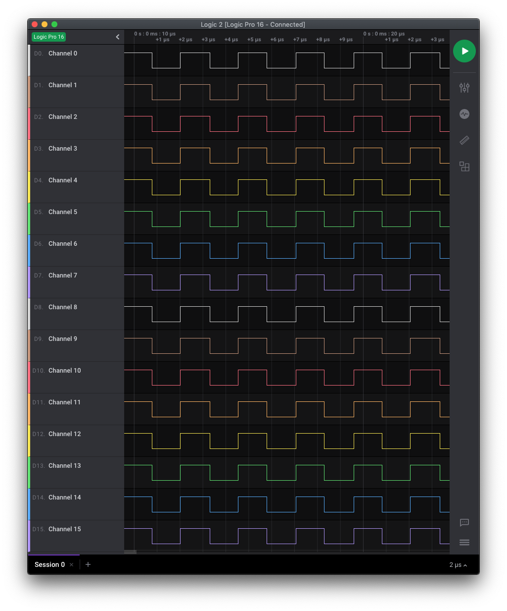
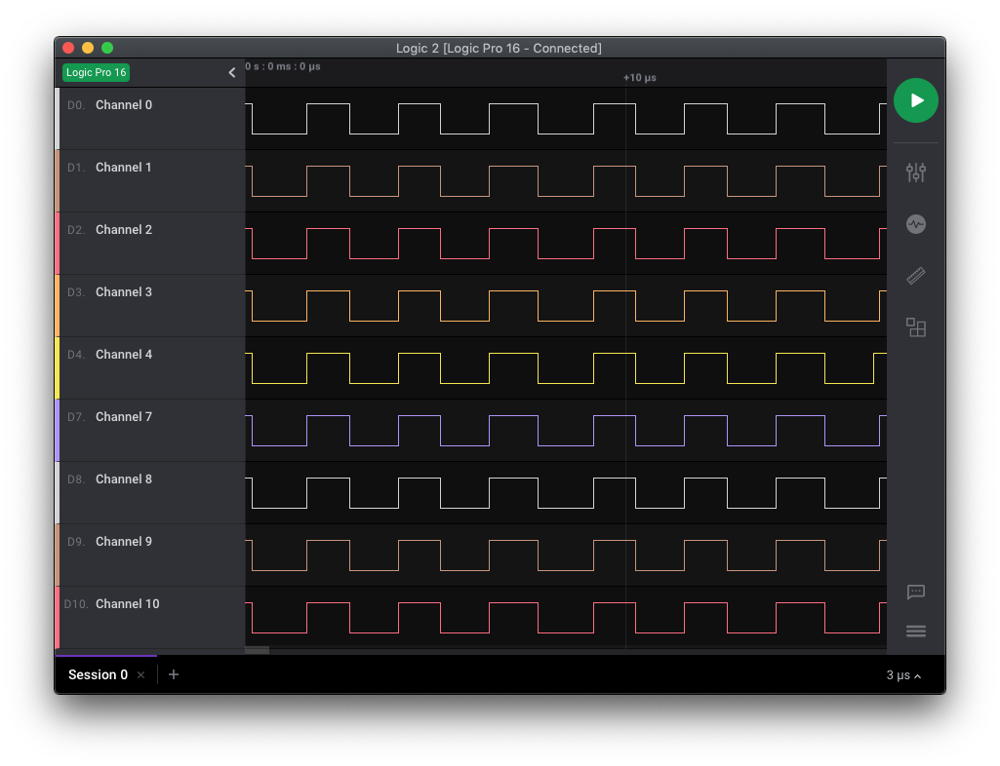
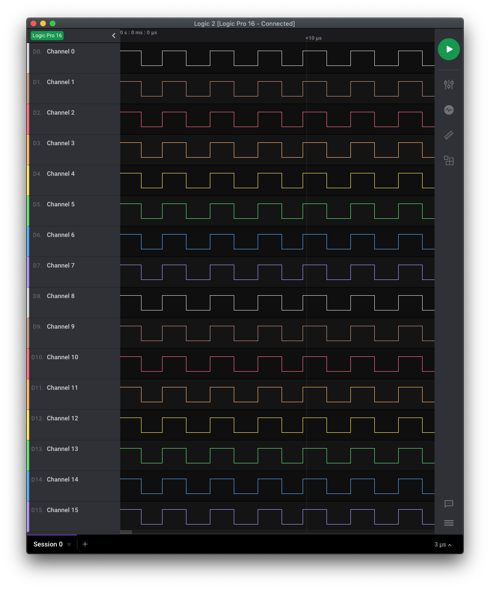
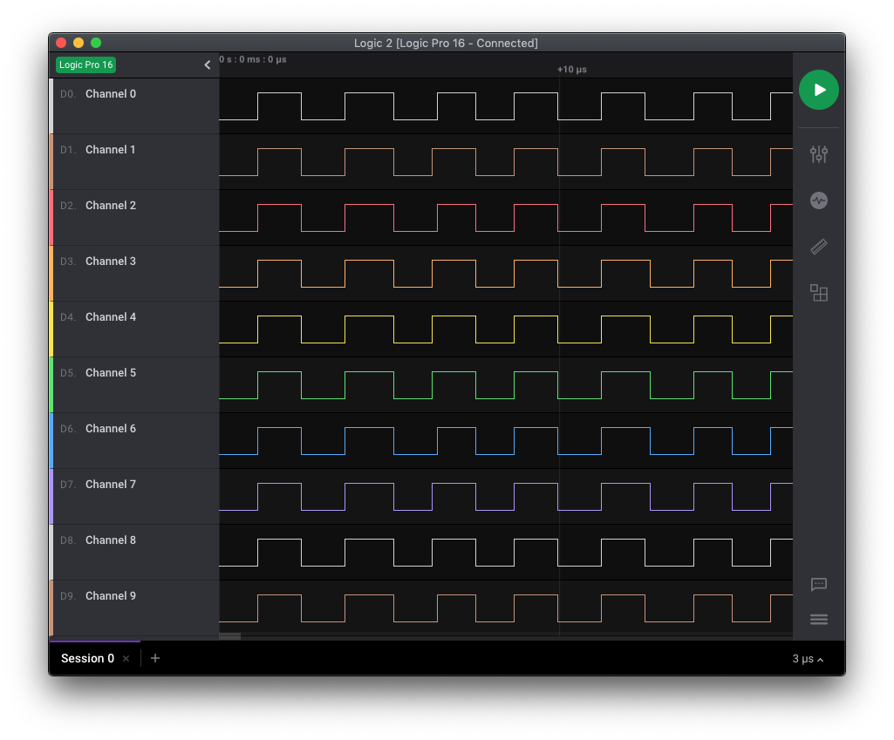

# PIC24FJxxGA002/GA004 - GPIO.

## 0.Contents.

- [1.PIC24FJxxGA002 GPIO.](#1pic24fjxxga002-gpio)
- [2.PIC24FJxxGA004 GPIO.](#2gpio-pic24fjxxga004-gpio)

## 1.PIC24FJxxGA002 GPIO.

```c
// Configuration Registers.
#pragma config DSWDTPS = DSWDTPSF, DSWDTOSC = LPRC
#pragma config RTCOSC = SOSC, DSBOREN = ON, DSWDTEN = ON
#pragma config WPFP = WPFP63, SOSCSEL = IO, WUTSEL = LEG
#pragma config WPDIS = WPDIS, WPCFG = WPCFGDIS, WPEND = WPENDMEM
#pragma config POSCMOD = NONE, I2C1SEL = PRI, IOL1WAY = ON
#pragma config OSCIOFNC = ON, FCKSM = CSDCMD, FNOSC = FRC, IESO = OFF
#pragma config WDTPS = PS32768, FWPSA = PR128, WINDIS = OFF
#pragma config FWDTEN = OFF, ICS = PGx1, GWRP = OFF, GCP = OFF, JTAGEN = OFF

#include <xc.h>
// PIC24FJxxGA002 - Compile with XC16(v2.00).
// PIC24FJxxGA002 - @8MHz Internal Oscillator.

// GPIO Ports.

// PIC16-Bit Mini Trainer.
// JUMPER.URX - Open.
// JUMPER.UTX - Open.
// JUMPER.SDA - Open.
// JUMPER.SCL - Open.
// JUMPER.VREG - GND.
// JUMPER.VCAP - Close.
// JUMPER.BCKL - Open.

// PIC16-Bit Trainer.
// JUMPER.SDA - Open.
// JUMPER.SCL - Open.
// JUMPER.VEE - Open.
// JUMPER.BCKL - Open.
// JUMPER.VREG - GND.
// JUMPER.VCAP - Close.
// JUMPER.SPI/I2C - Open.

// Main.
int main(void)
{
    // MCU Initialization.
    // Oscillator Settings.
    CLKDIVbits.DOZE = 0b000;
    CLKDIVbits.DOZEN = 0b0;
    // Ports Initialization.
    // Analog Inputs Settings.
    AD1PCFG = 0b1001111000111111;
    // Port A Settings.
    TRISA = 0b0000000000000000;
    PORTA = 0b0000000000000000;
    LATA = 0b0000000000000000;
    ODCA = 0b0000000000000000;
    // Port B Settings.
    TRISB = 0b0000000000000000;
    PORTB = 0b0000000000000000;
    LATB = 0b0000000000000000;
    ODCB = 0b0000000000000000;

    while(1){
        LATA = ~LATA;
//        LATB = ~LATB;
    }
    return(0);
}
```

- Port A.

<p align="center"></p>

- Port B.

<p align="center"></p>

## 2.GPIO PIC24FJxxGA004 GPIO.

```c
// Configuration Registers.
#pragma config DSWDTPS = DSWDTPSF, DSWDTOSC = LPRC
#pragma config RTCOSC = SOSC, DSBOREN = ON, DSWDTEN = ON
#pragma config WPFP = WPFP63, SOSCSEL = IO, WUTSEL = LEG
#pragma config WPDIS = WPDIS, WPCFG = WPCFGDIS, WPEND = WPENDMEM
#pragma config POSCMOD = NONE, I2C1SEL = PRI, IOL1WAY = ON
#pragma config OSCIOFNC = ON, FCKSM = CSDCMD, FNOSC = FRC, IESO = OFF
#pragma config WDTPS = PS32768, FWPSA = PR128, WINDIS = OFF
#pragma config FWDTEN = OFF, ICS = PGx1, GWRP = OFF, GCP = OFF, JTAGEN = OFF

#include <xc.h>
// PIC24FJxxGA002 - Compile with XC16(v2.00).
// PIC24FJxxGA002 - @8MHz Internal Oscillator.

// GPIO Ports.

// PIC16-Bit Nano Trainer.
// JUMPER.SDA - Open.
// JUMPER.SCL - Open.

// Main.
int main(void)
{
    // MCU Initialization.
    // Oscillator Settings.
    CLKDIVbits.DOZE = 0b000;
    CLKDIVbits.DOZEN = 0b0;
    // Ports Initialization.
    // Analog Inputs Settings.
    AD1PCFG = 0b1001111111111111;
    // Port A Settings.
    TRISA = 0b0000000000000000;
    PORTA = 0b0000000000000000;
    LATA = 0b0000000000000000;
    ODCA = 0b0000000000000000;
    // Port B Settings.
    TRISB = 0b0000000000000000;
    PORTB = 0b0000000000000000;
    LATB = 0b0000000000000000;
    ODCB = 0b0000000000000000;
    // Port C Settings.
    TRISC = 0b0000000000000000;
    PORTC = 0b0000000000000000;
    LATC = 0b0000000000000000;
    ODCC = 0b0000000000000000;

    while(1){
        LATA = ~LATA;
//        LATB = ~LATB;
//        LATC = ~LATC;
    }
    return(0);
}
```

- Port A.

<p align="center"></p>

- Port B.

<p align="center"></p>

- Port C.

<p align="center"></p>

---
DISCLAIMER: THIS CODE IS PROVIDED WITHOUT ANY WARRANTY OR GUARANTEES.
USERS MAY USE THIS CODE FOR DEVELOPMENT AND EXAMPLE PURPOSES ONLY.
AUTHORS ARE NOT RESPONSIBLE FOR ANY ERRORS, OMISSIONS, OR DAMAGES THAT COULD
RESULT FROM USING THIS FIRMWARE IN WHOLE OR IN PART.
